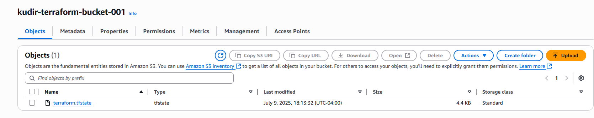

# Terraform Project: Modular AWS VPC and S3 Bucket Setup

This project demonstrates infrastructure-as-code using Terraform to provision:

- A custom Virtual Private Cloud (VPC)
- An S3 bucket
- Modularized configuration for reusable infrastructure components
- S3 backend state storage (remote state)

---

## 📁 Project Structure

```bash
terraform-modules-vpc-s3/
├── backend.tf                  # Remote backend configuration
├── main.tf                     # Main Terraform config to call modules
├── modules/
│   ├── s3/
│   │   └── main.tf             # S3 module definition
│   └── vpc/
│       └── main.tf             # VPC module definition
└── README.md                   # Project documentation

```
---

## 🔧 Prerequisites

- [Terraform](https://www.terraform.io/downloads.html) v1.5 or higher
- [AWS CLI](https://docs.aws.amazon.com/cli/latest/userguide/cli-chap-install.html) configured (`aws configure`)
- AWS IAM credentials with permission to create VPCs, S3 buckets, and DynamoDB tables

---

## ⚙️ What This Project Does

### ✅ Creates a VPC:
- Custom CIDR range
- Tagged for identification

### ✅ Creates an S3 Bucket:
- Custom name (globally unique)
- `force_destroy = true`
- Tagged for resource tracking

---

## 🚀 Getting Started

## 🧱 Module Configuration

### `modules/vpc/main.tf`

```hcl
resource "aws_vpc" "main" {
  cidr_block = "10.0.0.0/16"
  tags = {
    Name = "main-vpc"
  }
}

```

### `modules/s3/main.tf`
```hcl

resource "aws_s3_bucket" "bucket" {
  bucket = "kudir-terraform-bucket-002"  # Replace with a unique name
  force_destroy = true

  tags = {
    Name = "Terraform Created Resource Bucket"
  }
}
```

### `main.tf`
```bash
provider "aws" {
  region = "us-east-2"  # Change if needed
}

module "vpc" {
  source = "./modules/vpc"
  # Add variables if needed
}

module "s3_bucket" {
  source = "./modules/s3"
  # Add variables if needed
}
```


### 1. Create Backend S3 Bucket (for storing state)

This must be created **manually** before using `terraform init`:

```bash
aws s3 mb s3://your-backend-bucket-name --region us-east-2
```

### 2. Update backend.tf

```bash
terraform {
  backend "s3" {
    bucket         = "kudir-terraform-bucket-001"     # Replace with your S3 bucket
    key            = "terraform.tfstate"
    region         = "us-east-2"                        # Adjust if needed
    encrypt        = true
    dynamodb_table = "your-lock-table"                  # Replace with your DynamoDB lock table
  }
}
```

### 3. Initialize Terraform
`terraform init`

If backend config changes, reinitialize with: 
`terraform init -reconfigure`

### 4. Apply the Configuration
`terraform apply`

## Terraform will create:

A new VPC (unless limit is exceeded)


A new S3 bucket (unless already exists)


Backend storage for storing the Terraform state file.


## Troubleshooting
## 🧪 Issues Encountered

### ❗ S3 BucketAlreadyOwnedByYou

**Issue:**  
Initial apply failed because the S3 bucket name was already in use globally or owned by me.

**Fix:**  
Created a new unique bucket manually


S3 bucket names must be globally unique. Change the bucket name in my module to a unique name (e.g., append your name or timestamp).

❌ VpcLimitExceeded
AWS only allows 5 VPCs by default per region. Either:

Delete unused VPCs from your account

Use an existing VPC via data "aws_vpc"

Request a VPC limit increase in AWS Service Quotas

I deleted unused VPCs

